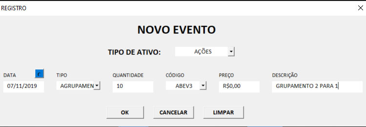
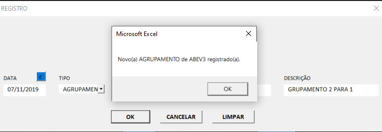
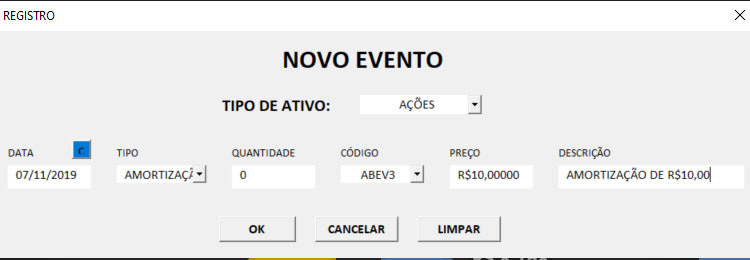
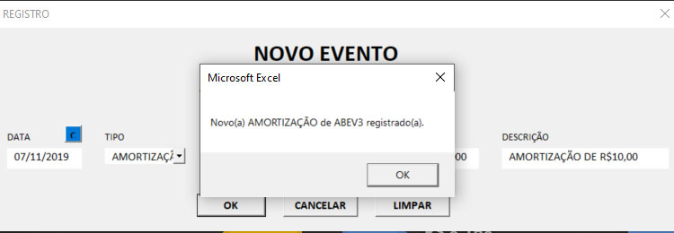
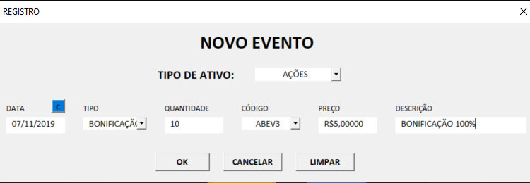
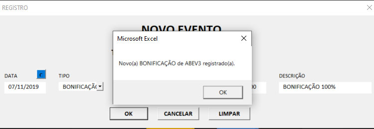
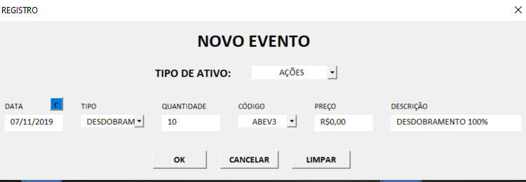
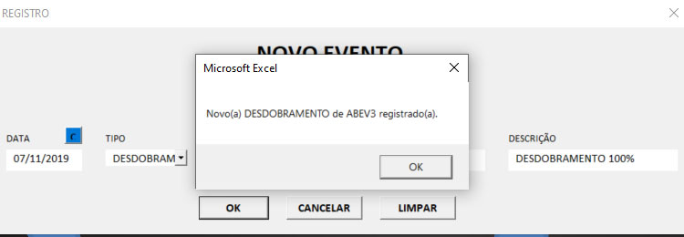
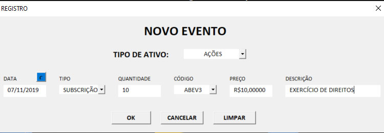
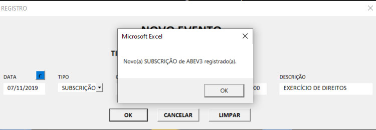

<iframe src="https://www.youtube.com/embed/ZjEqk2yNUXo" frameborder="0" allow="accelerometer; autoplay; encrypted-media; gyroscope; picture-in-picture" allowfullscreen></iframe>

## Visão Geral

O formulário para registro de eventos acionários é utilizado para registrar:

- Bonificações;
- Amortizações;
- Agrupamentos;
- Desdobramentos; e
- Subscrições.

O formulário é acessado através do menu REGISTRO > EVENTO na planilha "INICIAL", ou através do atalho CTRL+E:

Figura 1 - Menu Registro.

É possível navegar pelos campos utilizando a tecla TAB.

As informações registradas nesse formulário são gravadas na planilha "XXX-LANÇAMENTOS".

## Agrupamento

Um agrupamento ocorre quando uma empresa diminui o número de ações que compõem o seu capital social. Normalmente essa redução é feita de forma proporcional. Por exemplo: 2 ações são agrupadas em 1 ação.

Um agrupamento deve ser registrado especificando a quantidade de ações que foram "perdidas". Por exemplo:

- Você possuía 100 ações INVE3;
- Houve um agrupamento de 2 para 1;
- Você passará a ter 50 ações INVE3;
- A sua custódia foi reduzida em 50 ações. **Este é a quantidade a ser utilizada no formulário**.

Para registrar um agrupamento:

1. Abra o formulário de registro de eventos;
2. Selecione o tipo de ativo;
3. Digite a data do evento ou utilize o calendário clicando no botão "C";
4. Selecione o tipo AGRUPAMENTO;
5. Digite a quantidade de ativos em que sua custódia deve ser reduzida;
6. Escolha o código da ação;
7. Digite o preço (nesse caso, mantenha R\$0,00);

**OBS**: Ao clicar em OK, o formulário confirmará se deseja registrar o preço como R\$0,00. Clique em "SIM" para continuar.

8. Digite uma descrição para o evento;
9. Clique em OK para confirmar o registro, CANCELAR para fechar o formulário ou LIMPAR para limpar os campos;

Figura 2 - Registro de agrupamento.

10. Após clicar em OK, aguarde a mensagem de confirmação de registro:

Figura 3 - Mensagem de confirmação de registro.

## Amortização

Uma amortização ocorre quando valores investidos são devolvidos ao investidor.

Esse tipo de evento é mais comum em Fundos de Investimento Imobiliário que vendem parte do seu patrimônio e distribuem o dinheiro da venda dos imóveis parte como lucro parte como amortização.

A atitude mais conservadora para cômputo de uma amortização é considerar o valor devolvido para cálculo do preço médio. Por exemplo:

- Você possuia 10 ações a um preço médio de R\$10,00;
- O FII faz uma amortização de R\$1,00 por cota; e
- Seu novo preço médio será o preço antigo menos a amortização (R\$1,00 por cota), ou seja, R\$9,00.

Para registrar uma amortização:

1. Abra o formulário de registro de eventos;
2. Selecione o tipo de ativo;
3. Digite a data do evento ou utilize o calendário clicando no botão "C";
4. Selecione o tipo AMORTIZAÇÃO;
5. Digite a quantidade de ativos em que sua custódia deve ser reduzida (nesse caso, mantenha 0);

**OBS**: Ao clicar em OK, o formulário confirmará se deseja registrar a quantidade como 0. Clique em "SIM" para continuar.

6. Escolha o código da ação;
7. Digite o **valor total amortizado**;
8. Digite uma descrição para o evento;
9. Clique em OK para confirmar o registro, CANCELAR para fechar o formulário ou LIMPAR para limpar os campos;

Figura 4 - Registro de amortização.

10. Após clicar em OK, aguarde a mensagem de confirmação de registro:

Figura 5 - Mensagem de confirmação de registro.

## Bonificação

Uma bonificação ocorre quando a empresa incorpora novo capital ao seu capital social e cria novas ações, distribuindo-as ao atuais sócios da empresa.

**Toda ação bonificada terá um preço** que é informado pela empresa para fins de cômputo do Imposto de Renda. 

Este é o preço que deve ser utilizado no formulário.

Para registrar uma bonificação:

1. Abra o formulário de registro de eventos;
2. Selecione o tipo de ativo;
3. Digite a data do evento ou utilize o calendário clicando no botão "C";
4. Selecione o tipo BONIFICAÇÃO;
5. Digite a quantidade de ativos bonificados;
6. Escolha o código da ação;
7. Digite o preço unitário das ações bonificadas;
8. Digite uma descrição para o evento;
9. Clique em OK para confirmar o registro, CANCELAR para fechar o formulário ou LIMPAR para limpar os campos;

Figura 6 - Registro de bonificação.

10. Após clicar em OK, aguarde a mensagem de confirmação de registro:

Figura 7 - Mensagem de confirmação de registro.

## Desdobramento

Um desdobramento ocorre quando a empresa aumenta as ações que compõem o seu capital social sem alterar o valor do mesmo.

Normalmente, um desdobramento será feito de forma proporcional. Por exemplo: Desdobramento de 1 para 2, ou 100% (para cada ação, o investidor receberá uma nova).

Para registrar eventos desse tipo, o usuário deve calcular quantas ações recebeu além das que já possuia e utilizar esse número no campo "QUANTIDADE".

Para registrar um desdobramento:

1. Abra o formulário de registro de eventos;
2. Selecione o tipo de ativo;
3. Digite a data do evento ou utilize o calendário clicando no botão "C";
4. Selecione o tipo DESDOBRAMENTO;
5. Digite a quantidade de ativos em que sua custódia deve ser aumentada;
6. Escolha o código da ação;
7. Digite o preço (nesse caso, mantenha R\$0,00);

**OBS**: Ao clicar em OK, o formulário confirmará se deseja registrar o preço como R\$0,00. Clique em "SIM" para continuar.

8. Digite uma descrição para o evento;
9. Clique em OK para confirmar o registro, CANCELAR para fechar o formulário ou LIMPAR para limpar os campos;

Figura 8 - Registro de desdobramento.

10. Após clicar em OK, aguarde a mensagem de confirmação de registro:

Figura 9 - Mensagem de confirmação de registro.

## Subscrição

Ao exercer seus direitos de subscrição, o investidor estará adquirindo novos ativos.

A diferença para uma compra normal é que, geralmente, não incidem taxas sobre o exercício dos direitos.

Dessa forma, uma subscrição exercida po ser registrada:

- Pelo formulário de registro de operações, zerando-se todas as taxas; ou
- Através do formulário de registro de eventos.

Para registrar o exercício de uma subscrição:

1. Abra o formulário de registro de eventos;
2. Selecione o tipo de ativo;
3. Digite a data do evento ou utilize o calendário clicando no botão "C";
4. Selecione o tipo SUBSCRIÇÃO;
5. Digite a quantidade de ativos subscritos;
6. Escolha o código da ação;
7. Digite o preço do exercício da subscrição;
8. Digite uma descrição para o evento;
9. Clique em OK para confirmar o registro, CANCELAR para fechar o formulário ou LIMPAR para limpar os campos;

Figura 10 - Registro de subscrição.

10. Após clicar em OK, aguarde a mensagem de confirmação de registro:

Figura 11 - Mensagem de confirmação de registro.
