

<iframe src="https://www.youtube.com/embed/A7RZGVKb7r4?" frameborder="0" allow="accelerometer; autoplay; encrypted-media; gyroscope; picture-in-picture" allowfullscreen></iframe>

## Visão Geral

Para registrar uma operação de COMPRA ou VENDA, utilize o formulário de registro de operação, acessível através do menu REGISTRO > OPERAÇÃO:

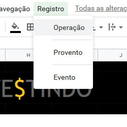

Figura 1 - Menu Registro.

Alguns campos são desabilitados para o usuário. Quando este for o caso:

- Os campos são desnecessários; ou
- São campos de cálculo automático.

O formulário possui um botão:

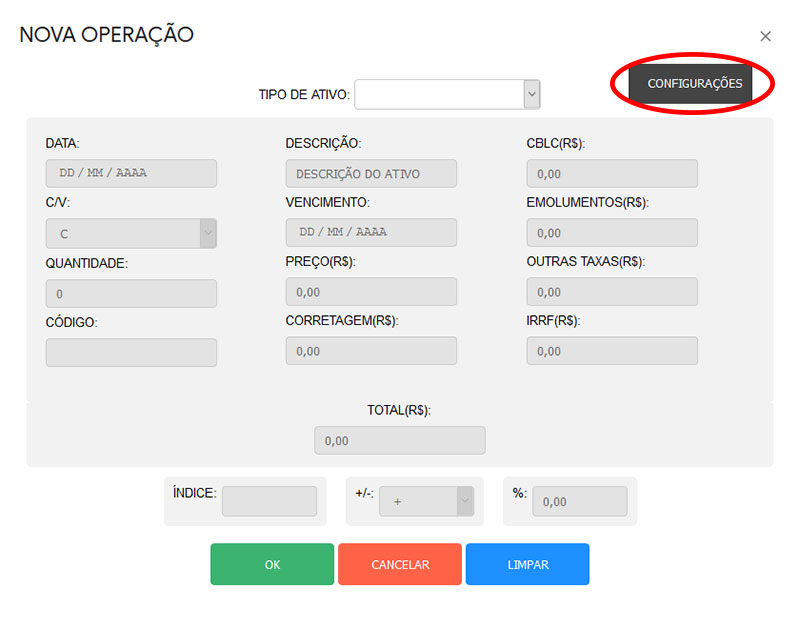

Figura 2 - Botões do formulário de registro de operações.

- **CONFIGURAÇÕES**: abre um formulário de configuração.

### Configurações

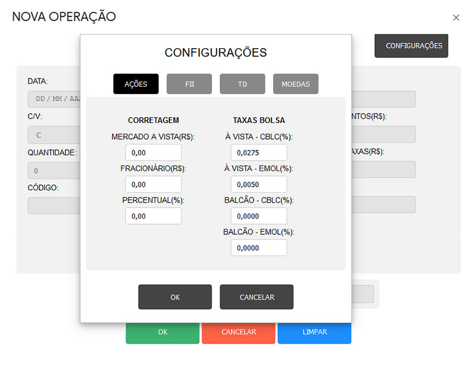

Figura 3 - Formulário de configurações.

O formulário de configurações permite alterar as informações constantes da planilha "CONFIGURAÇÕES", onde ficam gravadas informações utilizadas no cálculo automático tais como:

- taxas de corretagem; e
- taxas da bolsa.

O usuário pode editar as informações no próprio formulário. Ao clicar em "OK", elas serão gravadas na planilha "CONFIGURAÇÕES".

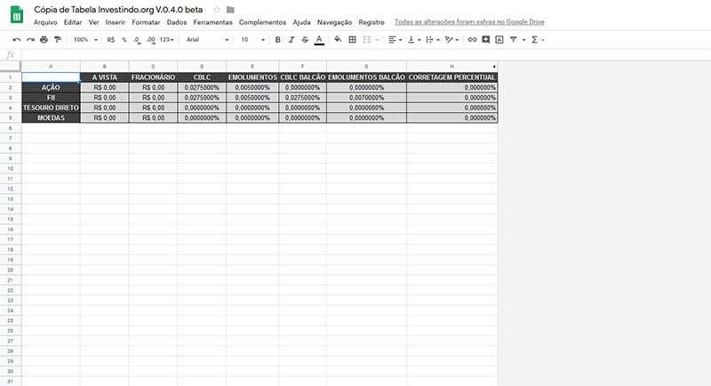

Figura 4 - Planilha CONFIGURAÇÕES.

## Ação

Para registrar uma operação com ações:

1. Abra o formulário de registro;
2. Selecione o TIPO DE ATIVO > AÇÃO;
3. Digite a data da operação;
4. Selecione "C" para compra ou "V" para venda;
5. Digite a quantidade operada;
6. Digite o código (*ticker*) da ação;
7. Digite o preço de compra ou venda;
8. Confira se a corretagem e as taxas de CBLC e EMOLUMENTOS foram calculadas automaticamente;
9. Preencha os campos OUTRAS TAXAS e IRRF quando houver;
10. Confira se o cálculo do VALOR TOTAL está correto;
11. Clique em OK para confirmar o registro, CANCELAR para fechar o formulário ou LIMPAR para limpar os campos;

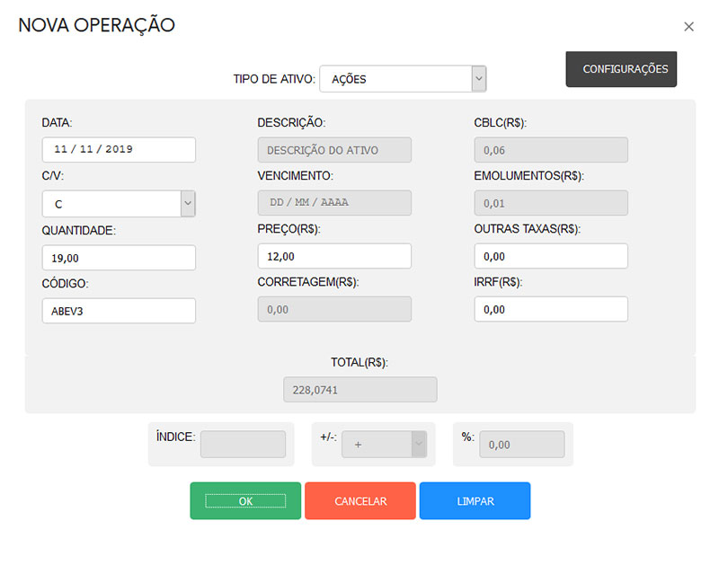

Figura 5 - Registro de operação com ação.

12. Após clicar em OK, aguarde a mensagem de confirmação de registro:

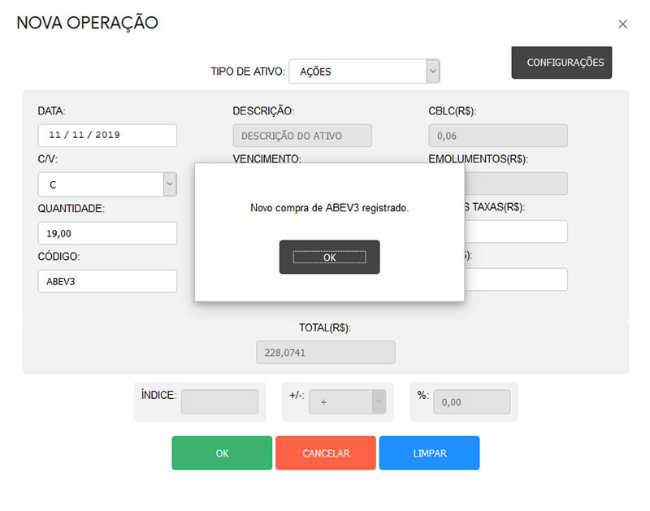

Figura 6 - Mensagem de confirmação de registro.

13. Verifique se os dados foram registrados corretamente na planilha 'LANÇAMENTOS".

## Fundos Imobiliários (FII)

Para registrar uma operação com cotas de FII:

1. Abra o formulário de registro;
2. Selecione o TIPO DE ATIVO > FII;
3. Digite a data da operação;
4. Selecione "C" para compra ou "V" para venda;
5. Digite a quantidade operada;
6. Digite o código (*ticker*) do FII;
7. Digite o preço de negociação;
8. Confira se a corretagem e as taxas de CBLC e EMOLUMENTOS foram calculadas automaticamente;
9. Preencha os campos OUTRAS TAXAS e IRRF quando houver;
10. Confira se o cálculo do VALOR TOTAL está correto;
11. Clique em OK para confirmar o registro, CANCELAR para fechar o formulário ou LIMPAR para limpar os campos:

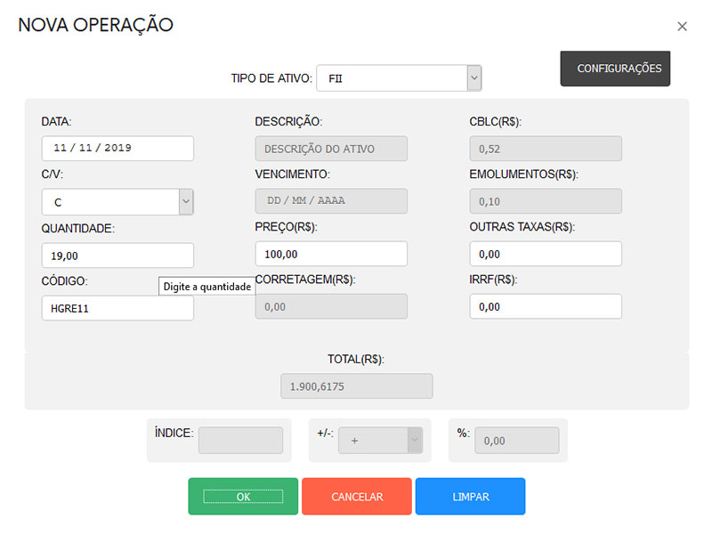

Figura 7 - Registro de operação de FII.

12. Após clicar em OK, aguarde a mensagem de confirmação de registro:

Figura 8 - Mensagem de confirmação de registro.

13. Verifique se os dados foram registrados corretamente na planilha 'LANÇAMENTOS".

## Tesouro Direto

Para registrar uma operação com um título público:

1. Abra o formulário de registro;
2. Selecione o TIPO DE ATIVO > TESOURO DIRETO;
3. Digite a data da operação;
4. Selecione "C" para compra ou "V" para venda;
5. Digite a quantidade operada;
6. Selecione o tipo de título;

**OBS**: Digite o nome do título da mesma forma que consta no *site* Tesouro Direto. Ex: Tesouro IPCA+ 2035, Tesouro Prefixado 2023 etc.

7. Digite a data de vencimento do título;
8. Digite o preço de negociação;
9. Confira se a corretagem e as taxas de CBLC e EMOLUMENTOS foram calculadas automaticamente;
10. Preencha os campos OUTRAS TAXAS e IRRF quando houver.
11. Preencha as informações de rentabilidade do título caso deseje:

O registro dos índices que remuneram os títulos é opcional e segue a seguinte lógica:

- IPCA + 5,00%%: será registrado como:

<table class="regularTable">
<thead>
<tr>
<td>ÍNDICE</td>
<td>+/x</td>
<td>%</td>
</tr>
</thead>
<tbody>
<tr>
<td>IPCA</td>
<td>+</td>
<td>5,00</td>
</tr>
</tbody>
</table>

- 120% do CDI será registrado como:

<table class="regularTable">
<thead>
<tr>
<td>ÍNDICE</td>
<td>+/x</td>
<td>%</td>
</tr>
</thead>
<tbody>
<tr>
<td>CDI</td>
<td>x</td>
<td>120</td>
</tr>
</tbody>
</table>

12. Confira se o cálculo do VALOR TOTAL está correto;
13. Clique em OK para confirmar o registro, CANCELAR para fechar o formulário ou LIMPAR para limpar os campos:

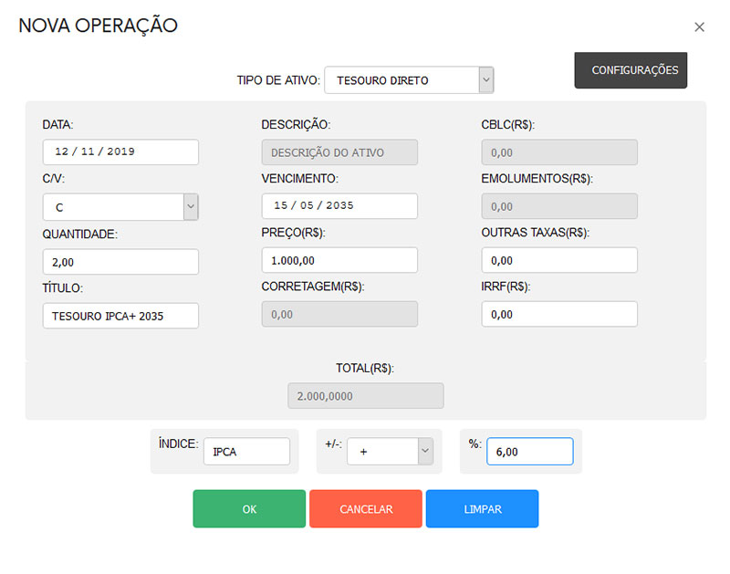

Figura 9 - Registro de operação de Tesouro Direto.

14. Após clicar em OK, aguarde a mensagem de confirmação de registro:

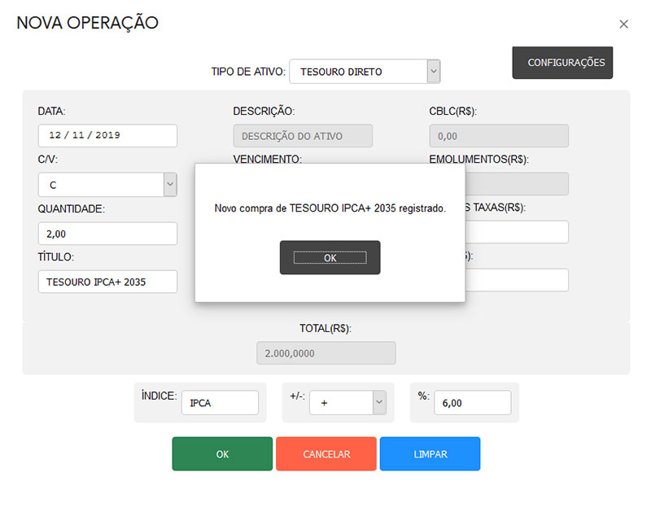

Figura 10 - Mensagem de confirmação de registro.

15. Verifique se os dados foram registrados corretamente na planilha 'LANÇAMENTOS".

## Renda Fixa

Para registrar uma operação com ativos de renda fixa:

1. Abra o formulário de registro;
2. Selecione o TIPO DE ATIVO > RENDA FIXA;
3. Digite a data da operação;
4. Selecione "C" para depósito ou "V" para retirada;
5. Selecione o tipo de ativo;
6. Digite uma descrição para diferenciar o ativo;
7. Digite a data de vencimento do título quando houver;
8. Digite o valor movimentado;
9. Confira se a corretagem e as taxas de CBLC e EMOLUMENTOS foram calculadas automaticamente;
10. Preencha os campos OUTRAS TAXAS e IRRF quando houver.
11. Preencha as informações de rentabilidade do título caso deseje:

O registro dos índices que remuneram os títulos é opcional e segue a seguinte lógica:

- IPCA + 5,00%%: será registrado como:

<table class="regularTable">
<thead>
<tr>
<td>ÍNDICE</td>
<td>+/x</td>
<td>%</td>
</tr>
</thead>
<tbody>
<tr>
<td>IPCA</td>
<td>+</td>
<td>5,00</td>
</tr>
</tbody>
</table>

- 120% do CDI será registrado como:

<table class="regularTable">
<thead>
<tr>
<td>ÍNDICE</td>
<td>+/x</td>
<td>%</td>
</tr>
</thead>
<tbody>
<tr>
<td>CDI</td>
<td>x</td>
<td>120</td>
</tr>
</tbody>
</table>

12. Confira se o cálculo do VALOR TOTAL está correto;
13. Clique em OK para confirmar o registro, CANCELAR para fechar o formulário ou LIMPAR para limpar os campos:

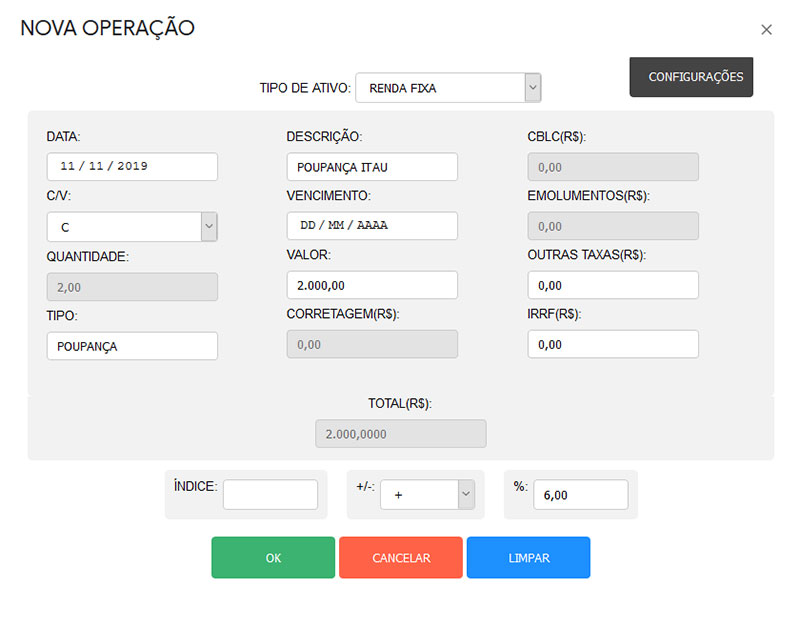

Figura 11 - Registro de operação de renda fixa.

14. Após clicar em OK, aguarde a mensagem de confirmação de registro:

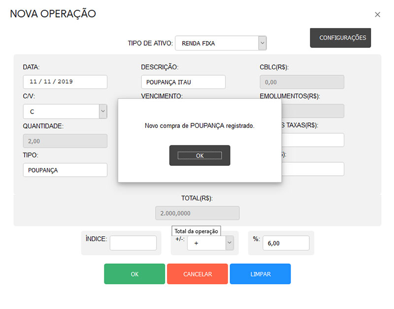

Figura 12 - Mensagem de confirmação de registro.

15. Verifique se os dados foram registrados corretamente na planilha 'LANÇAMENTOS".

## Fundos

Para registrar uma operação com cotas de um fundo de investimento:

1. Abra o formulário de registro;
2. Selecione o TIPO DE ATIVO > FUNDOS;
3. Digite a data da operação;
4. Selecione "C" para compra ou "V" para venda;
5. Selecione o tipo de ativo;
6. Digite uma descrição para diferenciar o ativo;
7. Digite o preço da cota;
8. Confira se a corretagem e as taxas de CBLC e EMOLUMENTOS foram calculadas automaticamente;
9. Preencha os campos OUTRAS TAXAS e IRRF quando houver.
10. Confira se o cálculo do VALOR TOTAL está correto;
11. Clique em OK para confirmar o registro, CANCELAR para fechar o formulário ou LIMPAR para limpar os campos:

Figura 13 - Registro de operação de fundos.

12. Após clicar em OK, aguarde a mensagem de confirmação de registro:

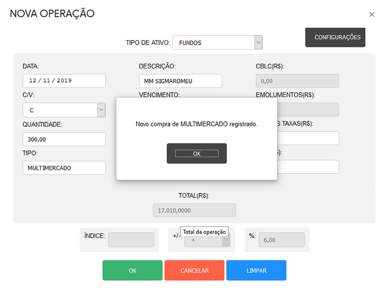

Figura 14 - Mensagem de confirmação de registro.

## Moedas

Para registrar uma operação com moedas:

1. Abra o formulário de registro;
2. Selecione o TIPO DE ATIVO > AÇÃO;
3. Digite a data da operação;
4. Selecione "C" para compra ou "V" para venda;
5. Digite a quantidade operada;
6. Digite o [código ISO](https://pt.wikipedia.org/wiki/ISO_4217) da moeda;

**Exemplo**: Dólar Americano (USD); Dólar Australiano (AUD) etc.

7. Digite o preço de compra ou venda;
8. Confira se a corretagem e as taxas de CBLC e EMOLUMENTOS foram calculadas automaticamente;
9. Preencha os campos OUTRAS TAXAS e IRRF quando houver;
10. Confira se o cálculo do VALOR TOTAL está correto;
11. Clique em OK para confirmar o registro, CANCELAR para fechar o formulário ou LIMPAR para limpar os campos;

Figura 15 - Registro de operação com moedas.

12. Após clicar em OK, aguarde a mensagem de confirmação de registro:

Figura 16 - Mensagem de confirmação de registro.

13. Verifique se os dados foram registrados corretamente na planilha 'LANÇAMENTOS".